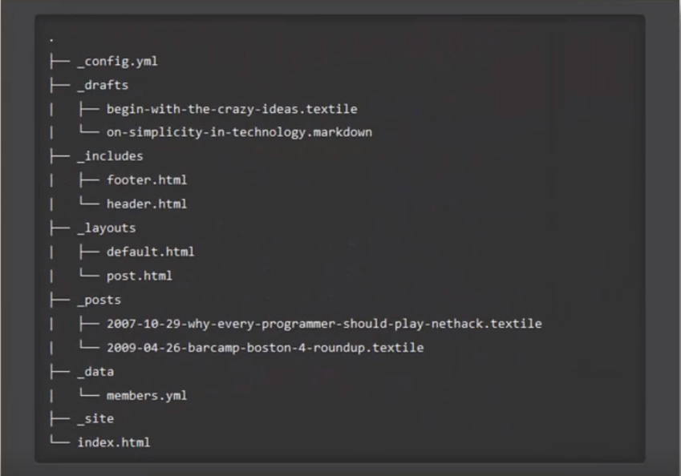

# Demo 2

## 链接demo

### 内嵌式链接

- 外部链接：[百度](http://www.baidu.com)  
- 内部链接1，链接仓库中的其他文件：[demo1](demo1.md)  
- 内部链接2，链接本文档的其他部分：[代码块demo](demo2.md#代码块-demo)  

### 引用式链接

- 外部链接：[百度]  
- 外部链接：[百度][baidu]  
- 内部链接1，链接仓库中的其他文件：[demo1] 
- 内部链接2，链接本文档的其他部分：[代码块demo]  

## 图片 demo

- 图片的markdown语法  
    ![alt] (url text)  
    
- 外部图片  
  

- 仓库内的图片 demo  


- 图片的引用式 demo  
![baidu][baidu_logo] 
![jekyll structure][jekyll_png]

## 引用 demo

> 这是一段引文。  

——出自《出处》

多重引用。
>>> 这是多重引文。

## 代码块 demo

- 行内代码

这个代码中用来声明变量是`var a=10`，打印变量内容是`console.log` 函数的调用。

- 块式代码  

```javascript
var a = 10;
console.log(a);
```

    var a = 10;
    console.log(a);


<!-- 下面是本文档用到的链接 -->

[百度]: http://www.baidu.com
[baidu]: http://www.baidu.com
[demo1]: demo1.md  
[代码块demo]: demo2.md#代码块-demo  

<!-- 下面是本图片用到的链接 -->

[baidu_logo]: https://www.baidu.com/img/bd_logo1.png?where=super    
[jekyll_png]: images/jekyll_structure.png  